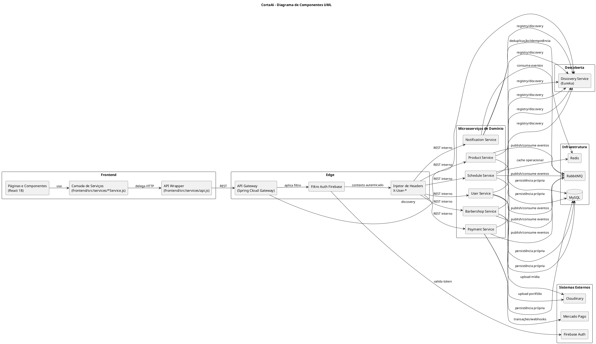

# 🧩 Diagrama de Componentes — CortaAi (UML)

> **Data:** 08 de maio de 2026  
> **Escopo:** componentes lógicos, contratos e integrações entre módulos

---

## Diagrama de componentes (padrão UML / PlantUML)

## Regras arquiteturais representadas

- Controllers expõem apenas DTOs.
- Mutações cross-service devem ser orientadas a eventos no RabbitMQ.
- Consultas cross-service devem ocorrer via Feign nos serviços consumidores.
- `api-gateway` é o ponto central de validação Firebase e propagação de contexto do usuário.

## O que é cada coisa (visão lógica)

### Frontend e borda

- **Páginas e Componentes (React 18):** camada de interface que renderiza telas e orquestra ações do usuário.
- **Camada de Serviços (`frontend/src/services/*Service.js`):** encapsula chamadas HTTP por domínio; evita requisição direta em componente.
- **API Wrapper (`frontend/src/services/api.js`):** cliente HTTP base (axios) com interceptação e configuração comum.
- **API Gateway:** ponto único de entrada; roteia endpoints e aplica políticas transversais.
- **Filtro Auth Firebase (gateway):** valida o ID token recebido do cliente.
- **Injetor `X-User-*` (gateway):** propaga identidade confiável para os microsserviços internos.

### Descoberta e comunicação

- **Discovery Service (Eureka):** registro e descoberta de instâncias para roteamento dinâmico entre serviços.
- **RabbitMQ:** barramento de eventos de domínio para comunicação assíncrona e desacoplada.

### Microsserviços de domínio

- **`user-service`:** gestão de usuários (cliente/barbeiro), perfis e dados de conta.
- **`barbershop-service`:** gestão de barbearias, catálogo e informações da operação.
- **`schedule-service`:** agenda, horários, confirmações e fluxo de agendamentos.
- **`payment-service`:** orquestração de pagamentos e ciclo financeiro da transação.
- **`product-service`:** estoque, produtos e movimentações relacionadas.
- **`notification-service`:** envio de notificações e tratamento idempotente de eventos.

### Infra de suporte e integrações externas

- **MySQL:** persistência relacional dos serviços (com isolamento lógico por serviço).
- **Redis:** cache operacional e deduplicação/idempotência.
- **Firebase Auth:** identidade/autenticação externa validada no gateway.
- **Mercado Pago:** processamento externo de pagamentos.
- **Cloudinary:** armazenamento e entrega de mídia (imagens/portfólio).

## Organização entre os documentos

- **Este arquivo (`DIAGRAMA_COMPONENTES.md`)** foca em **visão lógica** (quem depende de quem e qual responsabilidade de cada bloco).
- **`DIAGRAMA_IMPLANTACAO.md`** foca em **visão operacional** (containers, portas, execução e inventário do `docker compose ps`).

## Legenda UML utilizada

- **Dependência (`-->`)**: consumo de contrato/componente.
- **Componente (`component`)**: unidade implantável/lógica da solução.
- **Pacote (`package`)**: fronteira arquitetural.
