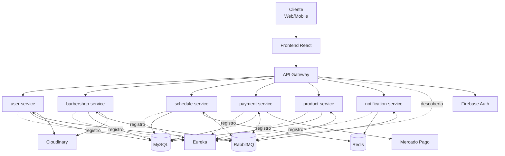

# 🧩 Diagrama de Componentes — CortaAi

> **Data:** 08 de maio de 2026  
> **Escopo:** componentes lógicos e contratos entre módulos

---

## Visão de componentes da solução

```mermaid
flowchart LR
  %% =========================
  %% FRONTEIRAS
  %% =========================
  subgraph FE[Frontend (React)]
    Pages[Páginas / Componentes]
    UIServices[services/*Service.js]
    ApiWrapper[services/api.js\nAxios Wrapper]
    Pages --> UIServices --> ApiWrapper
  end

  subgraph GW[api-gateway]
    Routes[Route Locator]
    AuthFilter[Firebase Auth Filter]
    HeaderInjector[Header Injector\nX-User-*]
    GWHandler[GlobalExceptionHandler]
    Routes --> AuthFilter --> HeaderInjector
  end

  subgraph US[user-service]
    CtrlUS[Controller DTO]
    SvcUS[Service]
    RepoUS[Repository JPA]
    MapperUS[Mapper]
    MsgUS[Publisher/Listener]
    CtrlUS --> SvcUS --> RepoUS
    SvcUS --> MapperUS
    SvcUS --> MsgUS
  end

  subgraph BS[barbershop-service]
    CtrlBS[Controller DTO]
    SvcBS[Service]
    RepoBS[Repository JPA]
    MapperBS[Mapper]
    FeignBS[Feign Client]
    MsgBS[Publisher/Listener]
    CtrlBS --> SvcBS --> RepoBS
    SvcBS --> MapperBS
    SvcBS --> FeignBS
    SvcBS --> MsgBS
  end

  subgraph SS[schedule-service]
    CtrlSS[Controller DTO]
    SvcSS[Service]
    RepoSS[Repository JPA]
    MapperSS[Mapper]
    FeignSS[Feign Client]
    MsgSS[Publisher/Listener]
    CtrlSS --> SvcSS --> RepoSS
    SvcSS --> MapperSS
    SvcSS --> FeignSS
    SvcSS --> MsgSS
  end

  subgraph PS[payment-service]
    CtrlPS[Controller DTO]
    SvcPS[Service]
    RepoPS[Repository JPA]
    MapperPS[Mapper]
    FeignPS[Feign Client]
    MsgPS[Publisher/Listener]
    CtrlPS --> SvcPS --> RepoPS
    SvcPS --> MapperPS
    SvcPS --> FeignPS
    SvcPS --> MsgPS
  end

  subgraph PRS[product-service]
    CtrlPRS[Controller DTO]
    SvcPRS[Service]
    RepoPRS[Repository JPA]
    MapperPRS[Mapper]
    FeignPRS[Feign Client]
    MsgPRS[Publisher/Listener]
    CtrlPRS --> SvcPRS --> RepoPRS
    SvcPRS --> MapperPRS
    SvcPRS --> FeignPRS
    SvcPRS --> MsgPRS
  end

  subgraph NS[notification-service]
    ListenerNS[Rabbit Listeners]
    SvcNS[Notification Service]
    DedupNS[Deduplicação Redis]
    ProviderNS[Provider Email/Push]
    ListenerNS --> SvcNS --> DedupNS
    SvcNS --> ProviderNS
  end

  subgraph INFRA[Infra Compartilhada]
    Rabbit[RabbitMQ]
    Redis[Redis]
    MySQL[(MySQL)]
    Firebase[Firebase Auth]
    MercadoPago[Mercado Pago]
    Cloudinary[Cloudinary]
  end

  %% =========================
  %% CONTRATOS ENTRE BLOCOS
  %% =========================
  ApiWrapper -->|REST| Routes
  AuthFilter -->|valida token| Firebase

  HeaderInjector -->|REST interno| CtrlUS
  HeaderInjector -->|REST interno| CtrlBS
  HeaderInjector -->|REST interno| CtrlSS
  HeaderInjector -->|REST interno| CtrlPS
  HeaderInjector -->|REST interno| CtrlPRS

  SvcBS -->|consulta| FeignBS
  SvcSS -->|consulta| FeignSS
  SvcPS -->|consulta| FeignPS
  SvcPRS -->|consulta| FeignPRS

  MsgUS <--> |eventos| Rabbit
  MsgBS <--> |eventos| Rabbit
  MsgSS <--> |eventos| Rabbit
  MsgPS <--> |eventos| Rabbit
  MsgPRS <--> |eventos| Rabbit
  ListenerNS <--> |eventos| Rabbit

  RepoUS -->|persistência| MySQL
  RepoBS -->|persistência| MySQL
  RepoSS -->|persistência| MySQL
  RepoPS -->|persistência| MySQL
  RepoPRS -->|persistência| MySQL

  SvcSS -->|cache| Redis
  DedupNS -->|idempotência| Redis

  SvcPS -->|pagamentos| MercadoPago
  SvcUS -->|mídia| Cloudinary
  SvcBS -->|mídia| Cloudinary

```

---

## Diagrama visual da arquitetura (alto nível)



---

## Regras arquiteturais representadas

- Controllers expõem apenas DTOs (sem exposição direta de entidades JPA).
- Escritas entre serviços são orientadas a eventos via RabbitMQ.
- Leitura cross-service ocorre via Feign em serviços que precisam de consulta externa.
- `api-gateway` é o ponto de validação Firebase e propagação de contexto do usuário.

## Legenda de leitura do diagrama

- **Seta contínua (`-->`)**: chamada síncrona (REST/Feign) ou fluxo interno do serviço.
- **Seta bidirecional (`<-->`)**: comunicação assíncrona por eventos no RabbitMQ.
- **Rótulos de aresta** explicam o contrato (`REST`, `consulta`, `persistência`, `eventos`, `cache`).
