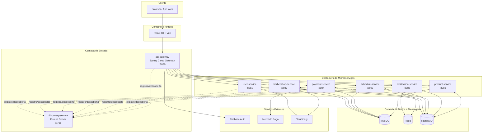

# 🚀 Diagrama de Implantação — CortaAi

> **Data:** 08 de maio de 2026  
> **Escopo:** ambiente de execução em arquitetura de microsserviços

---

## Visão de implantação (Docker Compose / ambiente servidor)

---

## Mapeamento resumido por responsabilidade

- **Entrada e segurança:** `api-gateway` valida token Firebase e injeta headers confiáveis `X-User-*`.
- **Descoberta:** `discovery-service` centraliza registro via Eureka.
- **Dados:** banco por serviço (compartilhando instância de MySQL no ambiente local), Redis para cache/deduplicação.
- **Integrações:** Mercado Pago (pagamentos), Cloudinary (mídia), Firebase (identidade).
- **Comunicação assíncrona:** RabbitMQ para eventos de domínio entre serviços.
