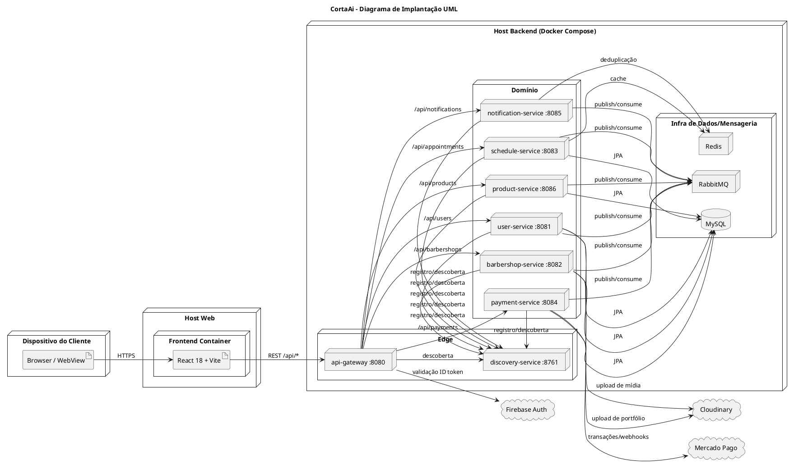

# 🚀 Diagrama de Implantação — CortaAi (UML)

> **Data:** 08 de maio de 2026  
> **Escopo:** topologia de execução em ambiente Docker Compose/servidor

---

## Diagrama de implantação (padrão UML / PlantUML)



---

## Desenho da arquitetura em caracteres (implantação)

```text
                          [ Cliente ]
                              |
                          HTTPS/SPA
                              v
                    +----------------------+
                    | Frontend React/Vite |
                    +----------+-----------+
                               |
                               | REST /api/*
                               v
                    +----------------------+
                    | api-gateway :8080    |
                    | auth + roteamento    |
                    +----+----+----+-------+
                         |    |    |
      +------------------+    |    +------------------+
      |                       |                       |
      v                       v                       v
+-------------+       +---------------+       +---------------+
|user :8081   |       |schedule :8083 |       |payment :8084  |
+------+------+       +-------+-------+       +-------+-------+
       |                      |                       |
       |                      +--> Redis (cache)      +--> Mercado Pago
       +--> Cloudinary

+-------------+       +---------------+       +------------------+
|barber :8082 |       |product :8086  |       |notification :8085|
+------+------+       +-------+-------+       +---------+--------+
       |                      |                         |
       +--> Cloudinary        |                         +--> Redis (dedup)
                              |
            +-----------------+------------------------------+
            |           RabbitMQ (eventos)                   |
            +-----------------+------------------------------+
                              |
                    +---------v---------+
                    | discovery :8761   |
                    | Eureka            |
                    +-------------------+

            Persistência relacional por serviço (ambiente local em MySQL)
```

---

## Mapeamento resumido por responsabilidade

- **Entrada e segurança:** `api-gateway` valida Firebase e injeta `X-User-*`.
- **Descoberta:** `discovery-service` centraliza registro/lookup via Eureka.
- **Dados e integração interna:** MySQL, Redis e RabbitMQ dentro da malha de execução.
- **Integrações externas:** Mercado Pago, Cloudinary e Firebase.

## Inventário operacional dos containers (docker compose)

> Referência: consolidação informada no `docker compose ps` com **12 containers ativos**.

### Total por categoria

- **Microsserviços:** 8 containers
  - **Negócio:** 6
  - **Infraestrutura:** 2
- **Frontend:** 1 container
- **Dados/Ferramentas:** 3 containers

### 1) Microsserviços de negócio (6)

- **`user-service`** — gestão de usuários (cadastro, perfil, papéis e dados de identidade de domínio).
- **`barbershop-service`** — gestão de barbearias (dados da unidade, catálogo e informações da loja).
- **`schedule-service`** — gestão de agenda e agendamentos.
- **`payment-service`** — gestão e integração de pagamentos.
- **`product-service`** — gestão de produtos e estoque.
- **`notification-service`** — envio e orquestração de notificações orientadas a evento.

### 2) Microsserviços de infraestrutura (2)

- **`api-gateway`** — entrada única das requisições externas; autentica/autoriza no edge e distribui para serviços internos.
- **`discovery-service`** — servidor Eureka para registro e descoberta entre serviços.

### 3) Frontend (1)

- **`cortaai-web`** — interface web da aplicação (entrega da SPA), executada em container próprio.

### 4) Bancos de dados e ferramentas (3)

- **`cortaai-mysql`** — banco relacional principal.
- **`cortaai-redis`** — cache e suporte a idempotência/deduplicação.
- **`cortaai-rabbitmq`** — broker de mensageria para eventos assíncronos.

### Leitura final da topologia

- A malha está separada em **camada de entrada (gateway)**, **camada de domínio (6 serviços)** e **camada de suporte (dados/mensageria/discovery)**.
- O conjunto de **12 containers** está coerente com uma arquitetura de microsserviços com fronteiras claras entre negócio e infraestrutura.

## Organização entre os documentos

- **Este arquivo (`DIAGRAMA_IMPLANTACAO.md`)** concentra o **diagrama visual operacional** e o **detalhamento dos containers**.
- **`DIAGRAMA_COMPONENTES.md`** concentra o **detalhamento lógico-funcional** dos componentes e contratos.

## Legenda UML utilizada

- **Nó (`node`)**: ambiente/container/processo implantado.
- **Artefato (`artifact`)**: unidade executável/entregável.
- **Nuvem (`cloud`)**: dependência externa.
- **Conectores (`-->`)**: fluxo de comunicação e dependência operacional.
