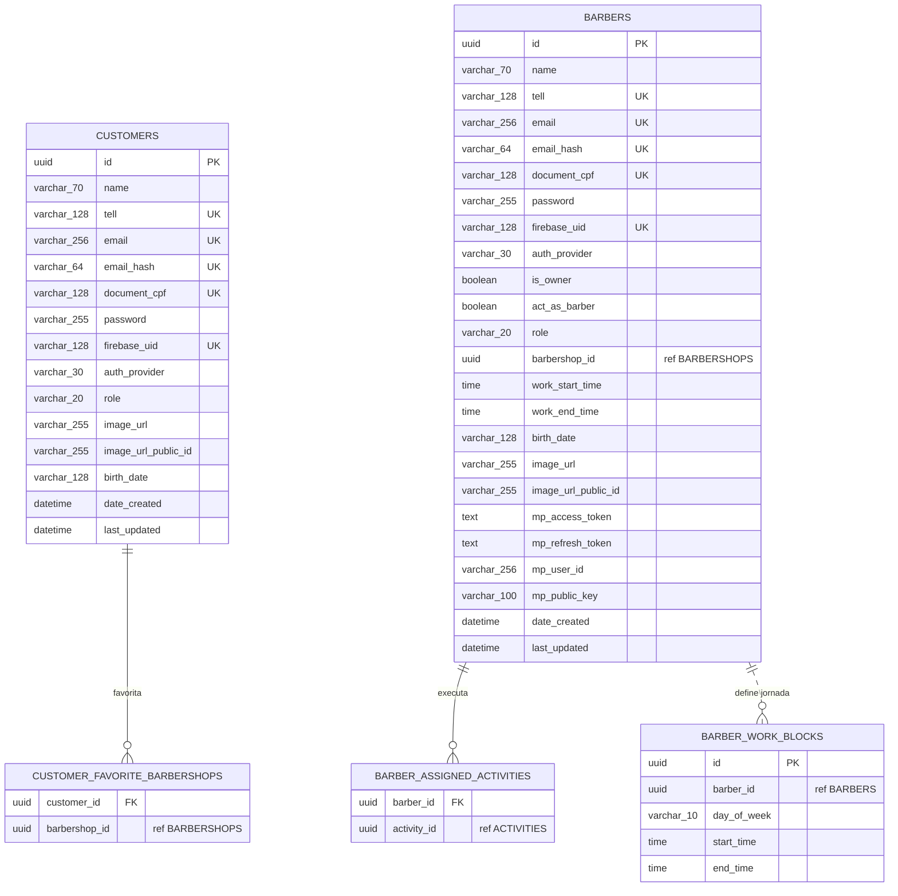
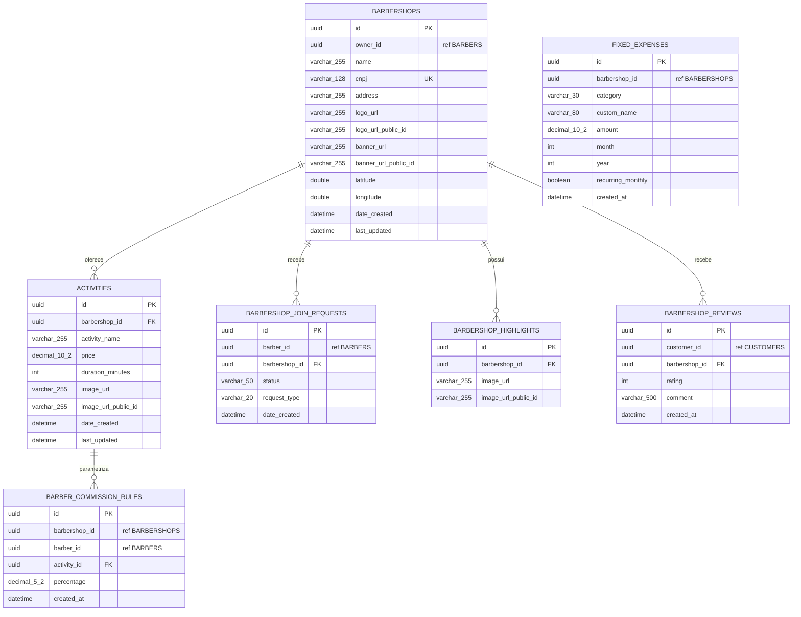
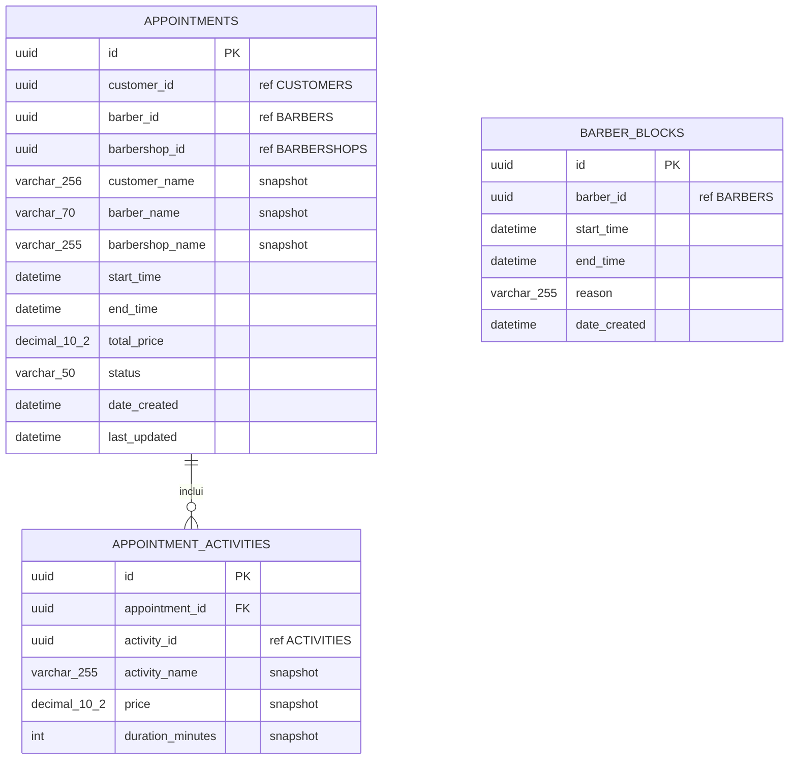
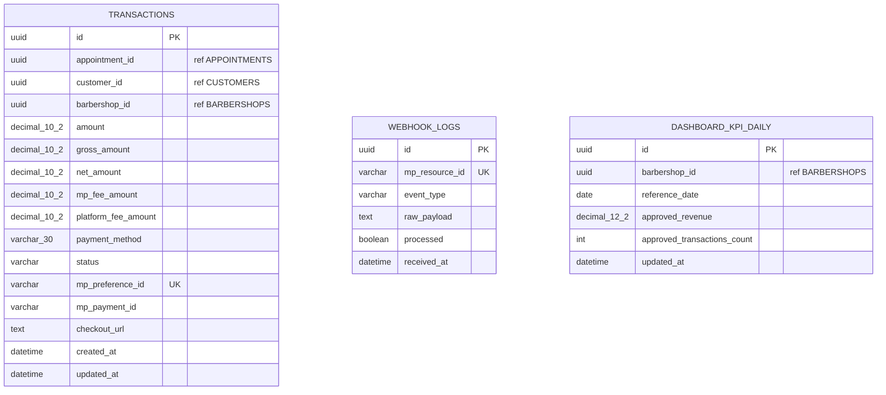
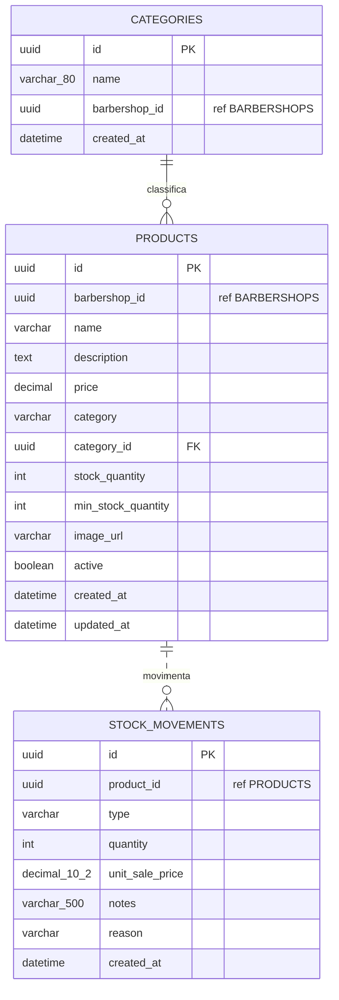
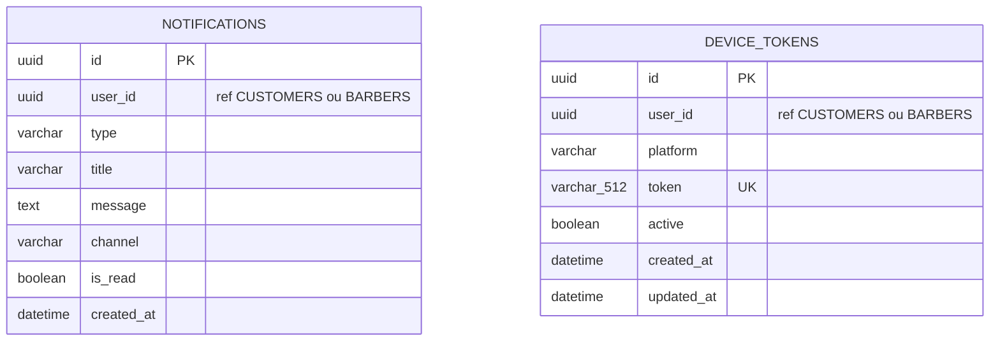

# Diagrama Entidade-Relacionamento (DER) - Arquitetura de Microservicos

Este DER representa o modelo fisico/logico identificado nas entidades JPA da aplicacao CortaAi.

Na arquitetura de microservicos, cada servico possui seu proprio banco. Por isso:

- Relacionamentos dentro do mesmo banco podem ser FKs reais.
- Relacionamentos entre bancos/servicos sao referencias logicas por UUID, sem FK fisica.
- Campos marcados como `ref` apontam para entidades mantidas por outro servico.
- Campos marcados como `snapshot` guardam uma copia do dado no momento da operacao.
- Views analiticas aparecem em uma secao separada, pois nao sao tabelas transacionais.

## Bancos

| Banco | Servico | Responsabilidade |
|---|---|---|
| `user_db` | `user-service` | Clientes, barbeiros, favoritos, atividades atribuidas e horarios de trabalho |
| `barbershop_db` | `barbershop-service` | Barbearias, servicos, avaliacoes, convites, destaques, comissoes e despesas |
| `schedule_db` | `schedule-service` | Agendamentos, atividades agendadas e bloqueios de agenda |
| `payment_db` | `payment-service` | Transacoes, webhooks e KPIs financeiros diarios |
| `product_db` | `product-service` | Produtos, categorias dinamicas e movimentacoes de estoque |
| `notification_db` | `notification-service` | Notificacoes e tokens de dispositivos |

## user_db



## barbershop_db



## schedule_db



## payment_db



## product_db



## notification_db



## Views analiticas

| Banco | View | Campos principais |
|---|---|---|
| `user_db` | `v_customer_acquisition` | `reference_month`, `new_customers` |
| `user_db` | `v_customer_retention` | `reference_month`, `returning_customers` |
| `schedule_db` | `v_agenda_thermometer` | `agenda_date`, `barbershop_id`, `total_appointments`, `active_appointments`, `lost_appointments` |
| `schedule_db` | `v_barber_skill_matrix` | `barber_id`, `activity_name`, `barbershop_id`, `barber_name`, `times_executed`, `total_generated_by_activity` |
| `payment_db` | `v_daily_financial_summary` | resumo financeiro diario |
| `payment_db` | `v_barber_financial_performance` | `barber_id`, `barber_name`, `barbershop_id`, `total_appointments`, `generated_revenue`, `contribution_percentage` |
| `product_db` | `v_stock_health_alert` | `product_id`, `barbershop_id`, `product_name`, `category`, `current_stock`, `predicted_minimum`, `requires_restock` |

## Referencias logicas entre servicos

```text
user-service
  CUSTOMERS.id
    -> barbershop-service.BARBERSHOP_REVIEWS.customer_id
    -> schedule-service.APPOINTMENTS.customer_id
    -> payment-service.TRANSACTIONS.customer_id
    -> notification-service.NOTIFICATIONS.user_id
    -> notification-service.DEVICE_TOKENS.user_id

  BARBERS.id
    -> barbershop-service.BARBERSHOPS.owner_id
    -> barbershop-service.BARBERSHOP_JOIN_REQUESTS.barber_id
    -> barbershop-service.BARBER_COMMISSION_RULES.barber_id
    -> schedule-service.APPOINTMENTS.barber_id
    -> schedule-service.BARBER_BLOCKS.barber_id

barbershop-service
  BARBERSHOPS.id
    -> user-service.BARBERS.barbershop_id
    -> user-service.CUSTOMER_FAVORITE_BARBERSHOPS.barbershop_id
    -> schedule-service.APPOINTMENTS.barbershop_id
    -> payment-service.TRANSACTIONS.barbershop_id
    -> payment-service.DASHBOARD_KPI_DAILY.barbershop_id
    -> product-service.PRODUCTS.barbershop_id
    -> product-service.CATEGORIES.barbershop_id

  ACTIVITIES.id
    -> user-service.BARBER_ASSIGNED_ACTIVITIES.activity_id
    -> schedule-service.APPOINTMENT_ACTIVITIES.activity_id

schedule-service
  APPOINTMENTS.id
    -> payment-service.TRANSACTIONS.appointment_id
```
