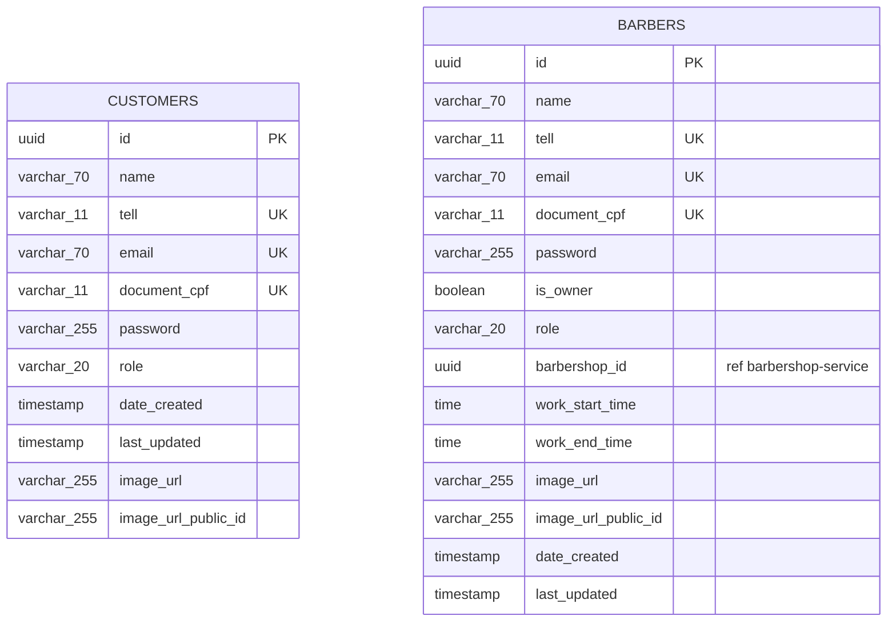
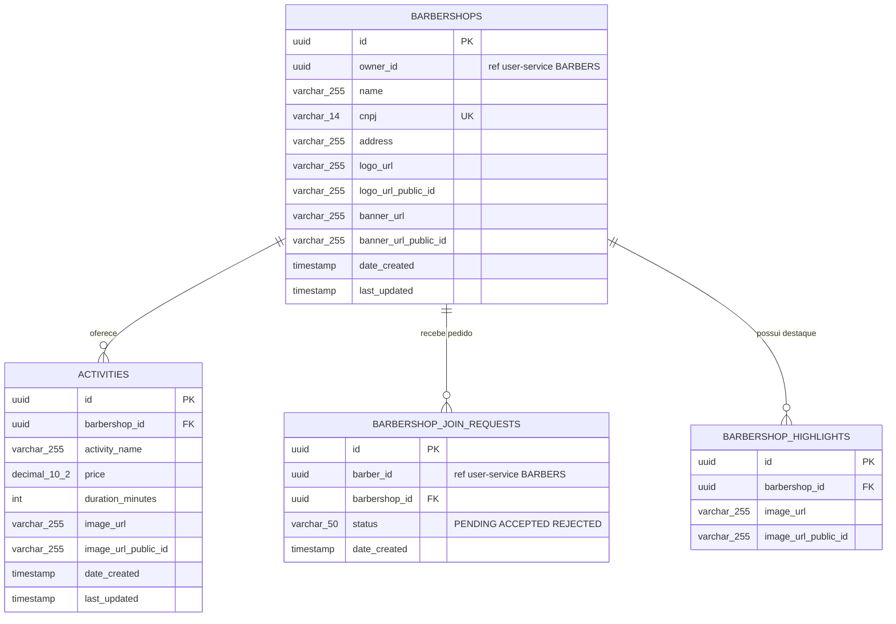
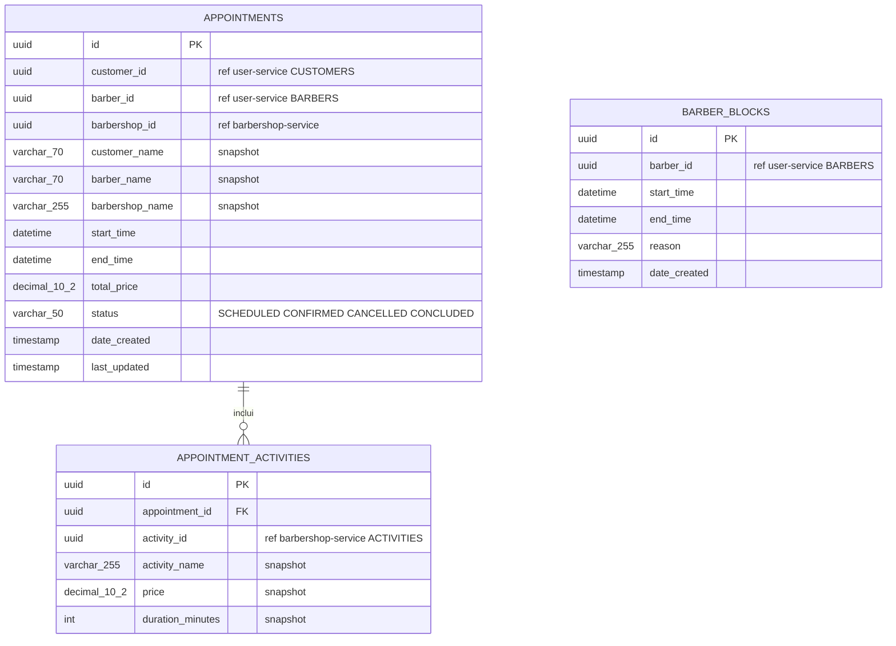
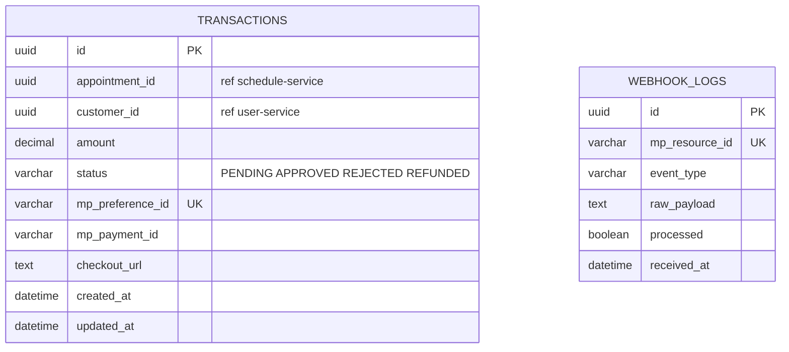
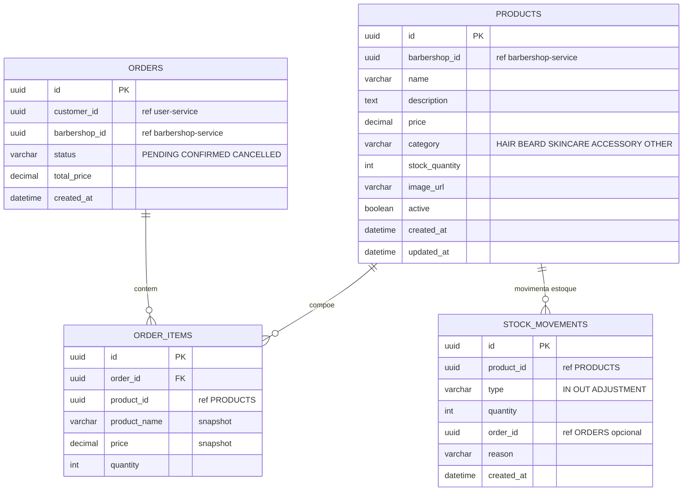
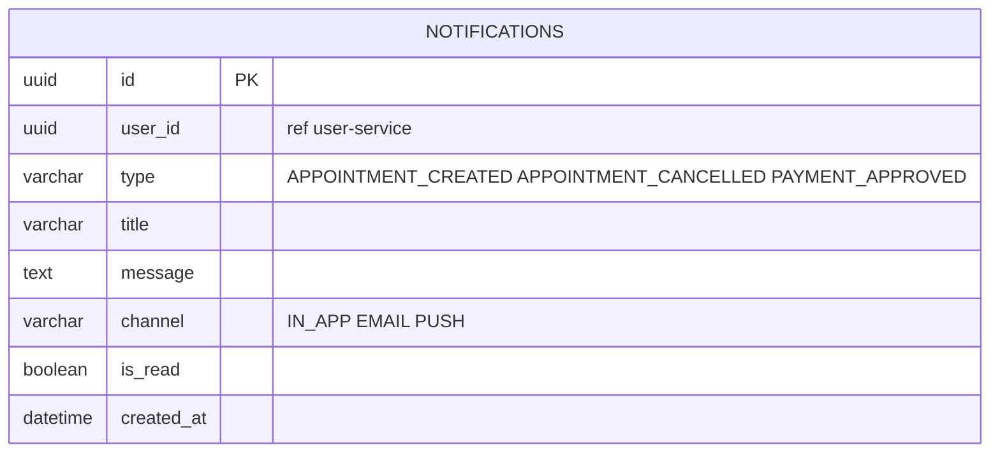

# Diagrama Entidade-Relacionamento (DER) — Arquitetura de Microservicos

> **Nota:** Na arquitetura de microservicos, cada servico possui seu proprio banco de dados.
> Relacionamentos entre servicos sao feitos por **IDs desacoplados** (nao ha FK real entre bancos).
> IDs marcados como `ref` indicam referencias logicas a entidades em outro servico.

---

## Visao por Servico

### user_db (user-service)



---

### barbershop_db (barbershop-service)



---

### schedule_db (schedule-service)



---

### payment_db (payment-service)



---

### product_db (product-service)



---

### notification_db (notification-service)



---

## Visao Geral — Referencias entre Servicos

```
user-service (user_db)
  CUSTOMERS ---ref---> schedule-service.APPOINTMENTS.customer_id
            ---ref---> payment-service.TRANSACTIONS.customer_id
            ---ref---> product-service.ORDERS.customer_id
            ---ref---> notification-service.NOTIFICATIONS.user_id
  BARBERS   ---ref---> barbershop-service.BARBERSHOP_JOIN_REQUESTS.barber_id
            ---ref---> schedule-service.APPOINTMENTS.barber_id
            ---ref---> schedule-service.BARBER_BLOCKS.barber_id

barbershop-service (barbershop_db)
  BARBERSHOPS ---ref---> schedule-service.APPOINTMENTS.barbershop_id
              ---ref---> product-service.PRODUCTS.barbershop_id
              ---ref---> product-service.ORDERS.barbershop_id
  ACTIVITIES  ---ref---> schedule-service.APPOINTMENT_ACTIVITIES.activity_id

schedule-service (schedule_db)
  APPOINTMENTS ---ref---> payment-service.TRANSACTIONS.appointment_id
```