# CortaAi - DER Visual (Mermaid)

Diagrama unificado das entidades principais da plataforma CortaAi.

- Linhas solidas (`--`) indicam relacao dentro do mesmo banco quando ha associacao JPA direta.
- Linhas tracejadas (`..`) indicam referencia logica entre servicos, sem FK fisica entre bancos.
- Campos de auditoria, imagem e tokens sensiveis foram omitidos para clareza.
- Detalhes completos em [`der.md`](der.md). Modelo conceitual em [`mer.md`](mer.md).

```mermaid
---
title: CortaAi - Diagrama Entidade-Relacionamento
---
erDiagram

    CUSTOMERS {
        uuid id PK
        varchar name
        varchar email UK
        varchar document_cpf UK
        varchar firebase_uid UK
        varchar role
    }

    BARBERS {
        uuid id PK
        varchar name
        varchar email UK
        varchar document_cpf UK
        boolean is_owner
        boolean act_as_barber
        uuid barbershop_id "ref BARBERSHOPS"
    }

    CUSTOMER_FAVORITE_BARBERSHOPS {
        uuid customer_id FK
        uuid barbershop_id "ref BARBERSHOPS"
    }

    BARBER_ASSIGNED_ACTIVITIES {
        uuid barber_id FK
        uuid activity_id "ref ACTIVITIES"
    }

    BARBER_WORK_BLOCKS {
        uuid id PK
        uuid barber_id "ref BARBERS"
        varchar day_of_week
        time start_time
        time end_time
    }

    BARBERSHOPS {
        uuid id PK
        uuid owner_id "ref BARBERS"
        varchar name
        varchar cnpj UK
        varchar address
    }

    ACTIVITIES {
        uuid id PK
        uuid barbershop_id FK
        varchar activity_name
        decimal price
        int duration_minutes
    }

    BARBERSHOP_JOIN_REQUESTS {
        uuid id PK
        uuid barber_id "ref BARBERS"
        uuid barbershop_id FK
        varchar status
        varchar request_type
    }

    BARBERSHOP_HIGHLIGHTS {
        uuid id PK
        uuid barbershop_id FK
        varchar image_url
    }

    BARBERSHOP_REVIEWS {
        uuid id PK
        uuid customer_id "ref CUSTOMERS"
        uuid barbershop_id FK
        int rating
    }

    BARBER_COMMISSION_RULES {
        uuid id PK
        uuid barbershop_id "ref BARBERSHOPS"
        uuid barber_id "ref BARBERS"
        uuid activity_id FK
        decimal percentage
    }

    FIXED_EXPENSES {
        uuid id PK
        uuid barbershop_id "ref BARBERSHOPS"
        varchar category
        decimal amount
        int month
        int year
    }

    APPOINTMENTS {
        uuid id PK
        uuid customer_id "ref CUSTOMERS"
        uuid barber_id "ref BARBERS"
        uuid barbershop_id "ref BARBERSHOPS"
        varchar customer_name "snapshot"
        varchar barber_name "snapshot"
        datetime start_time
        datetime end_time
        decimal total_price
        varchar status
    }

    APPOINTMENT_ACTIVITIES {
        uuid id PK
        uuid appointment_id FK
        uuid activity_id "ref ACTIVITIES"
        varchar activity_name "snapshot"
        decimal price "snapshot"
    }

    BARBER_BLOCKS {
        uuid id PK
        uuid barber_id "ref BARBERS"
        datetime start_time
        datetime end_time
        varchar reason
    }

    TRANSACTIONS {
        uuid id PK
        uuid appointment_id "ref APPOINTMENTS"
        uuid customer_id "ref CUSTOMERS"
        uuid barbershop_id "ref BARBERSHOPS"
        decimal amount
        varchar status
        varchar mp_preference_id UK
    }

    WEBHOOK_LOGS {
        uuid id PK
        varchar mp_resource_id UK
        varchar event_type
        boolean processed
    }

    DASHBOARD_KPI_DAILY {
        uuid id PK
        uuid barbershop_id "ref BARBERSHOPS"
        date reference_date
        decimal approved_revenue
    }

    CATEGORIES {
        uuid id PK
        varchar name
        uuid barbershop_id "ref BARBERSHOPS"
    }

    PRODUCTS {
        uuid id PK
        uuid barbershop_id "ref BARBERSHOPS"
        varchar name
        decimal price
        varchar category
        uuid category_id FK
        int stock_quantity
        int min_stock_quantity
    }

    STOCK_MOVEMENTS {
        uuid id PK
        uuid product_id "ref PRODUCTS"
        varchar type
        int quantity
    }

    NOTIFICATIONS {
        uuid id PK
        uuid user_id "ref CUSTOMERS ou BARBERS"
        varchar type
        varchar channel
        boolean is_read
    }

    DEVICE_TOKENS {
        uuid id PK
        uuid user_id "ref CUSTOMERS ou BARBERS"
        varchar platform
        varchar token UK
        boolean active
    }

    CUSTOMERS ||--o{ CUSTOMER_FAVORITE_BARBERSHOPS : "favorita"
    BARBERS ||--o{ BARBER_ASSIGNED_ACTIVITIES : "executa"
    BARBERS ||..o{ BARBER_WORK_BLOCKS : "define jornada"

    BARBERS ||..o| BARBERSHOPS : "e dono"
    BARBERSHOPS ||--o{ ACTIVITIES : "oferece"
    BARBERSHOPS ||--o{ BARBERSHOP_JOIN_REQUESTS : "recebe"
    BARBERSHOPS ||--o{ BARBERSHOP_HIGHLIGHTS : "possui"
    BARBERSHOPS ||--o{ BARBERSHOP_REVIEWS : "recebe"
    BARBERS ||..o{ BARBERSHOP_JOIN_REQUESTS : "participa"
    CUSTOMERS ||..o{ BARBERSHOP_REVIEWS : "avalia"
    ACTIVITIES ||--o{ BARBER_COMMISSION_RULES : "parametriza"

    CUSTOMERS ||..o{ APPOINTMENTS : "agenda"
    BARBERS ||..o{ APPOINTMENTS : "atende"
    BARBERSHOPS ||..o{ APPOINTMENTS : "sedia"
    APPOINTMENTS ||--o{ APPOINTMENT_ACTIVITIES : "inclui"
    ACTIVITIES ||..o{ APPOINTMENT_ACTIVITIES : "origina"
    BARBERS ||..o{ BARBER_BLOCKS : "bloqueia"

    APPOINTMENTS ||..o| TRANSACTIONS : "gera"
    CUSTOMERS ||..o{ TRANSACTIONS : "paga"
    BARBERSHOPS ||..o{ TRANSACTIONS : "recebe"
    BARBERSHOPS ||..o{ DASHBOARD_KPI_DAILY : "consolida"

    BARBERSHOPS ||..o{ CATEGORIES : "define"
    CATEGORIES ||--o{ PRODUCTS : "classifica"
    BARBERSHOPS ||..o{ PRODUCTS : "mantem"
    PRODUCTS ||..o{ STOCK_MOVEMENTS : "movimenta"

    CUSTOMERS ||..o{ NOTIFICATIONS : "recebe"
    BARBERS ||..o{ NOTIFICATIONS : "recebe"
    CUSTOMERS ||..o{ DEVICE_TOKENS : "usa"
    BARBERS ||..o{ DEVICE_TOKENS : "usa"
```

