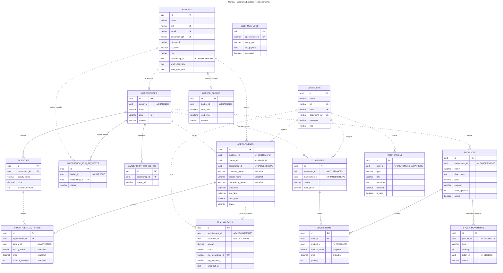

# CortaAi — Diagrama ER Visual (Mermaid)

> Diagrama unificado de todas as entidades da plataforma CortaAi.
> - Linhas **sólidas** (`--`) = FK real (mesmo banco de dados)
> - Linhas **tracejadas** (`..`) = referência lógica cross-service (sem FK real)
> - Campos de auditoria (`date_created`, `last_updated`) e imagem omitidos para clareza.
> - Detalhes completos em [`der.md`](der.md).

