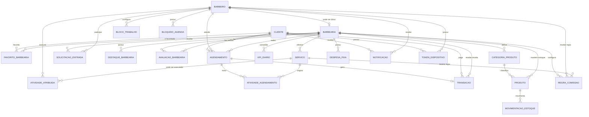

# Modelo Entidade-Relacionamento (MER) - CortaAi

Este MER descreve o modelo conceitual do banco da plataforma CortaAi. Ele nao foca nos detalhes fisicos de coluna, tipo SQL ou indice; para isso, consulte [`der.md`](der.md).

## Entidades principais

| Entidade | Descricao |
|---|---|
| Cliente | Usuario que agenda servicos, favorita barbearias, avalia barbearias e recebe notificacoes |
| Barbeiro | Profissional que atende agendamentos, possui agenda de trabalho e pode ser dono de uma barbearia |
| Barbearia | Estabelecimento que oferece servicos, possui destaques, avaliacoes, despesas e profissionais |
| Servico | Atividade oferecida por uma barbearia, com preco e duracao |
| Agendamento | Reserva de horario feita por um cliente com um barbeiro em uma barbearia |
| Atividade do Agendamento | Snapshot do servico escolhido dentro de um agendamento |
| Transacao | Registro financeiro associado a um agendamento |
| Produto | Item de estoque de uma barbearia |
| Categoria de Produto | Categoria customizavel usada para organizar produtos |
| Movimentacao de Estoque | Entrada, saida, venda, consumo, perda ou retorno de produto |
| Notificacao | Mensagem enviada a um usuario |
| Token de Dispositivo | Token usado para envio de push notification |

## Entidades de apoio

| Entidade | Descricao |
|---|---|
| Favorito de Barbearia | Associacao entre cliente e barbearia favoritada |
| Atividade Atribuida ao Barbeiro | Associacao entre barbeiro e servico que ele executa |
| Bloco de Trabalho do Barbeiro | Jornada recorrente semanal do barbeiro |
| Bloqueio de Agenda | Periodo indisponivel na agenda do barbeiro |
| Solicitacao de Entrada | Pedido ou convite para barbeiro entrar em uma barbearia |
| Destaque da Barbearia | Imagem promocional vinculada a uma barbearia |
| Avaliacao da Barbearia | Nota e comentario de cliente para uma barbearia |
| Regra de Comissao | Percentual de comissao por barbearia, barbeiro e servico |
| Despesa Fixa | Custo mensal ou recorrente de uma barbearia |
| KPI Diario | Consolidado diario de receita aprovada da barbearia |
| Webhook Log | Registro idempotente de eventos recebidos do Mercado Pago |

## Regras e cardinalidades

## Observacoes do modelo

- Cliente e barbeiro vivem no `user-service`, mas sao usados logicamente por varios outros servicos.
- Barbearia e servico vivem no `barbershop-service`; outros servicos guardam apenas seus UUIDs.
- Agendamento guarda snapshots de nomes e servicos para preservar o historico mesmo se os dados originais mudarem.
- Transacao referencia o agendamento e guarda dados de conciliacao financeira do pagamento.
- Produto, categoria e movimentacao representam estoque interno da barbearia; nao ha entidade atual de pedido de produto no codigo analisado.
- Notificacoes e tokens usam `user_id` como referencia logica para cliente ou barbeiro.
