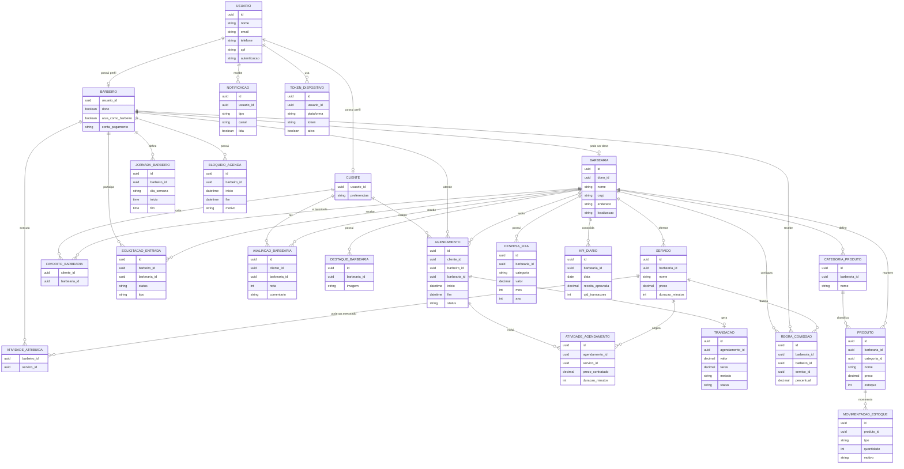
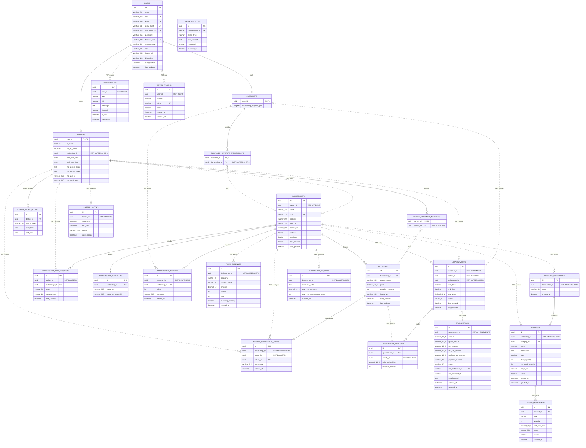

# MER e DER Normalizados - CortaAi

Este arquivo traz a mesma modelagem normalizada gerada em Draw.io, agora em Mermaid.

- `PK`: chave primaria
- `FK`: chave estrangeira fisica dentro do mesmo banco/microsservico
- `UK`: chave unica
- `REF`: referencia logica por UUID entre bancos/microsservicos

## MER Normalizado

## DER Normalizado

O DER completo tambem esta separado em [`der_normalizado.mmd`](der_normalizado.mmd), para evitar que este Markdown fique dificil de editar.

